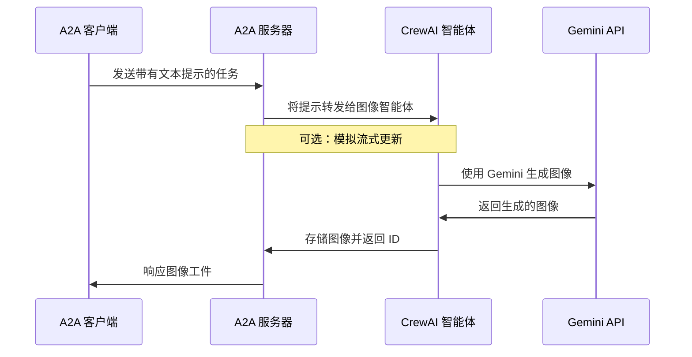

## 基于 A2A 协议的 CrewAI 智能体

本示例展示了一个基于 [CrewAI](https://www.crewai.com/open-source) 构建并通过 A2A 协议暴露的简单图像生成智能体。

## 工作原理

该智能体利用 CrewAI 和 Google Gemini API 基于文本提示生成图像。A2A 协议实现了与智能体的标准化交互，允许客户端发送请求并接收图像作为工件。



## 关键组件

- **CrewAI 智能体**：具有专门工具的图像生成智能体
- **A2A 服务器**：提供与智能体交互的标准化协议
- **图像生成**：使用 Gemini API 从文本描述创建图像
- **缓存系统**：存储生成的图像以供检索（内存或基于文件）

## 先决条件

- Python 3.12 或更高版本
- [UV](https://docs.astral.sh/uv/) 包管理器（推荐）
- Google API 密钥（用于访问 Gemini）

## 设置与运行

1. 导航到示例目录：

   ```bash
   cd samples/python/agents/crewai
   ```

2. 创建包含 API 密钥的环境文件：

   ```bash
   echo "GOOGLE_API_KEY=your_api_key_here" > .env
   ```

3. 设置 Python 环境：

   ```bash
   uv python pin 3.12
   uv venv
   source .venv/bin/activate
   ```

4. 使用所需选项运行智能体：

   ```bash
   # 基本运行
   uv run .

   # 在自定义主机/端口上运行
   uv run . --host 0.0.0.0 --port 8080
   ```

5. 在另一个终端中，运行 A2A 客户端：

   ```bash
   # 连接到智能体（指定正确端口的智能体 URL）
   uv run hosts/cli --agent http://localhost:10001
   
   # 如果启动智能体时更改了端口，请使用该端口
   # uv run hosts/cli --agent http://localhost:YOUR_PORT
   ```

## 特性与改进

**特性：**

- 使用 Google Gemini 进行文本到图像生成
- 支持使用参考图像修改现有图像
- 健壮的错误处理和自动重试机制
- 可选的基于文件的缓存持久化
- 改进的查询工件 ID 提取

**限制：**

- 无真正的流式处理（CrewAI 原生不支持）
- 有限的智能体交互（无多轮对话）

## 了解更多

- [A2A 协议文档](https://google.github.io/A2A/#/documentation)
- [CrewAI 文档](https://docs.crewai.com/introduction)
- [Google Gemini API](https://ai.google.dev/gemini-api)
