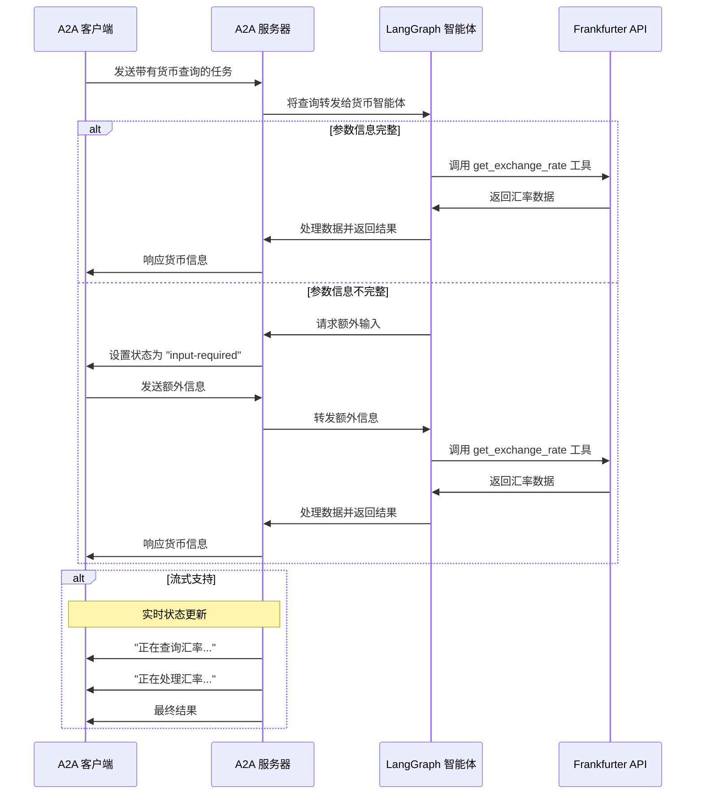

# 基于 A2A 协议的 LangGraph 货币智能体

本示例演示了一个基于 LangGraph 构建并通过 A2A 协议暴露的货币汇率智能体，支持多轮对话和流式响应。

## 工作原理

该智能体使用 LangGraph 与 Google Gemini 结合，通过 ReAct 模式提供货币汇率信息。A2A 协议实现了与智能体的标准化交互，使客户端能够发送请求并接收实时更新。



## 主要特性

- **多轮对话**：智能体可在需要时请求额外信息  
- **实时流式**：在处理过程中提供状态更新  
- **推送通知**：支持基于 Webhook 的通知  
- **对话记忆**：跨交互维护上下文  
- **货币兑换工具**：集成 Frankfurter API 获取实时汇率  

## 先决条件

- Python 3.13 或更高版本  
- [UV](https://docs.astral.sh/uv/)  
- 具备 LLM 访问权限和 API 密钥  

## 设置与运行

1. 进入示例目录：

   ```bash
   cd samples/python/agents/langgraph
   ```

2. 创建包含 API 密钥的环境文件：

   ```bash
   echo "GOOGLE_API_KEY=your_api_key_here" > .env
   ```

3. 运行代理：

   ```bash
   # 默认在 10000 端口运行
   uv run .

   # 指定主机/端口
   uv run . --host 0.0.0.0 --port 8080
   ```

4. 在另一个终端，运行 A2A 客户端：

   ```bash
   uv run hosts/cli
   ```

## 技术实现

- **LangGraph ReAct 智能体**：使用 ReAct 模式进行推理和工具调用  
- **流式支持**：在处理过程中提供增量更新  
- **检查点记忆**：在对话轮次之间维护会话状态  
- **推送通知系统**：基于 Webhook 并支持 JWK 鉴权  
- **A2A 协议集成**：完全符合 A2A 规范  

## 限制

- 仅支持文本输入/输出（不支持多模态）  
- 使用的 Frankfurter API 可用货币选项有限  
- 会话记忆基于会话，不会在服务重启后持久化  

## 示例

**同步请求**

请求：

```http
POST http://localhost:10000
Content-Type: application/json

{
  "jsonrpc": "2.0",
  "id": 11,
  "method": "tasks/send",
  "params": {
    "id": "129",
    "sessionId": "8f01f3d172cd4396a0e535ae8aec6687",
    "acceptedOutputModes": [
      "text"
    ],
    "message": {
      "role": "user",
      "parts": [
        {
          "type": "text",
          "text": "How much is the exchange rate for 1 USD to INR?"
        }
      ]
    }
  }
}
```

响应：

```json
{
  "jsonrpc": "2.0",
  "id": 11,
  "result": {
    "id": "129",
    "status": {
      "state": "completed",
      "timestamp": "2025-04-02T16:53:29.301828"
    },
    "artifacts": [
      {
        "parts": [
          {
            "type": "text",
            "text": "The exchange rate for 1 USD to INR is 85.49."
          }
        ],
        "index": 0
      }
    ],
    "history": []
  }
}
```

**多轮示例**

请求 - 第 1 步：

```http
POST http://localhost:10000
Content-Type: application/json

{
  "jsonrpc": "2.0",
  "id": 10,
  "method": "tasks/send",
  "params": {
    "id": "130",
    "sessionId": "a9bb617f2cd94bd585da0f88ce2ddba2",
    "acceptedOutputModes": [
      "text"
    ],
    "message": {
      "role": "user",
      "parts": [
        {
          "type": "text",
          "text": "How much is the exchange rate for 1 USD?"
        }
      ]
    }
  }
}
```

响应 - 第 2 步：

```json
{
  "jsonrpc": "2.0",
  "id": 10,
  "result": {
    "id": "130",
    "status": {
      "state": "input-required",
      "message": {
        "role": "agent",
        "parts": [
          {
            "type": "text",
            "text": "Which currency do you want to convert to? Also, do you want the latest exchange rate or a specific date?"
          }
        ]
      },
      "timestamp": "2025-04-02T16:57:02.336787"
    },
    "history": []
  }
}
```

请求 - 第 3 步：

```http
POST http://localhost:10000
Content-Type: application/json

{
  "jsonrpc": "2.0",
  "id": 10,
  "method": "tasks/send",
  "params": {
    "id": "130",
    "sessionId": "a9bb617f2cd94bd585da0f88ce2ddba2",
    "acceptedOutputModes": [
      "text"
    ],
    "message": {
      "role": "user",
      "parts": [
        {
          "type": "text",
          "text": "CAD"
        }
      ]
    }
  }
}
```

响应 - 第 4 步：

```json
{
  "jsonrpc": "2.0",
  "id": 10,
  "result": {
    "id": "130",
    "status": {
      "state": "completed",
      "timestamp": "2025-04-02T16:57:40.033328"
    },
    "artifacts": [
      {
        "parts": [
          {
            "type": "text",
            "text": "The current exchange rate is 1 USD = 1.4328 CAD."
          }
        ],
        "index": 0
      }
    ],
    "history": []
  }
}
```

**流式示例**

请求：

```json
{
  "jsonrpc": "2.0",
  "id": 12,
  "method": "tasks/sendSubscribe",
  "params": {
    "id": "131",
    "sessionId": "cebd704d0ddd4e8aa646aeb123d60614",
    "acceptedOutputModes": [
      "text"
    ],
    "message": {
      "role": "user",
      "parts": [
        {
          "type": "text",
          "text": "How much is 100 USD in GBP?"
        }
      ]
    }
  }
}
```

响应：

```
data: {"jsonrpc":"2.0","id":12,"result":{"id":"131","status":{"state":"working","message":{"role":"agent","parts":[{"type":"text","text":"Looking up the exchange rates..."}],
